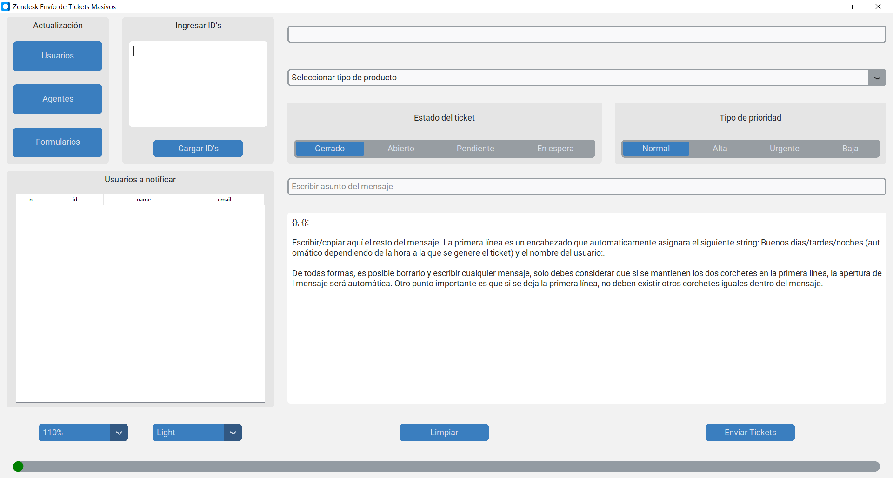
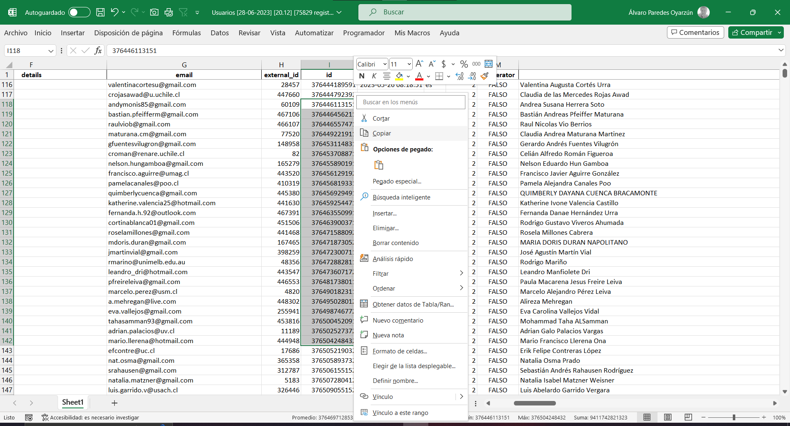
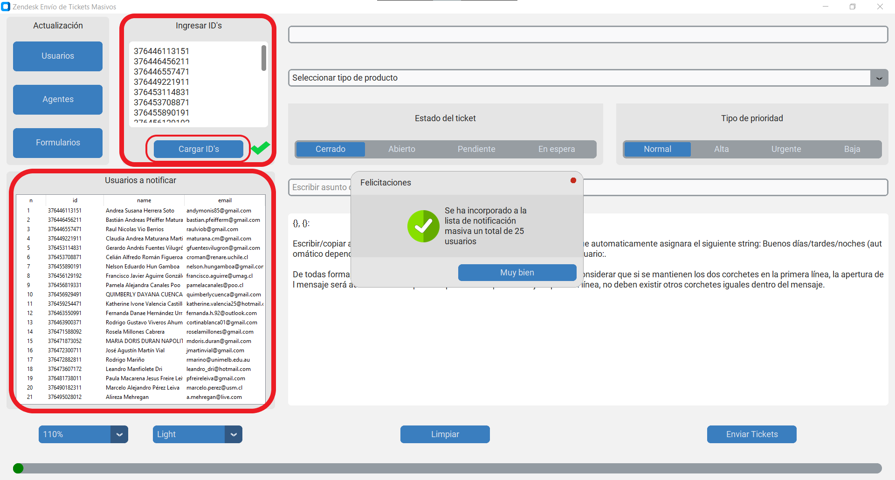
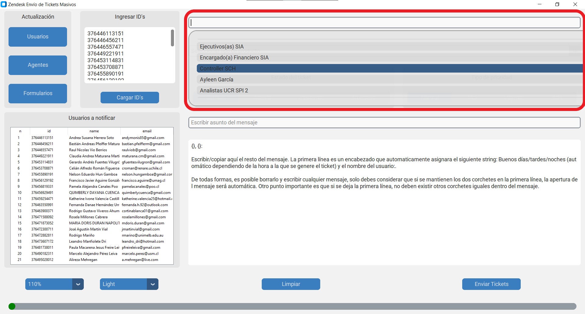
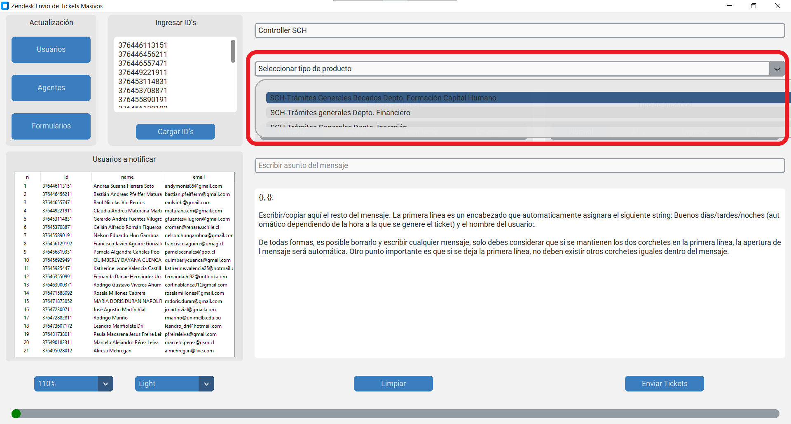
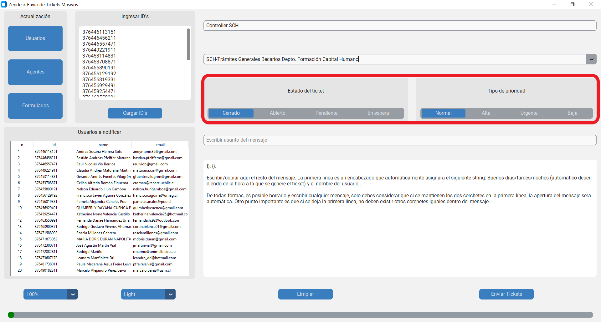
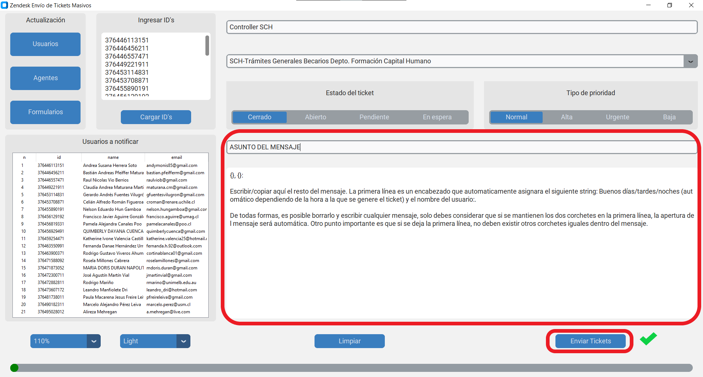
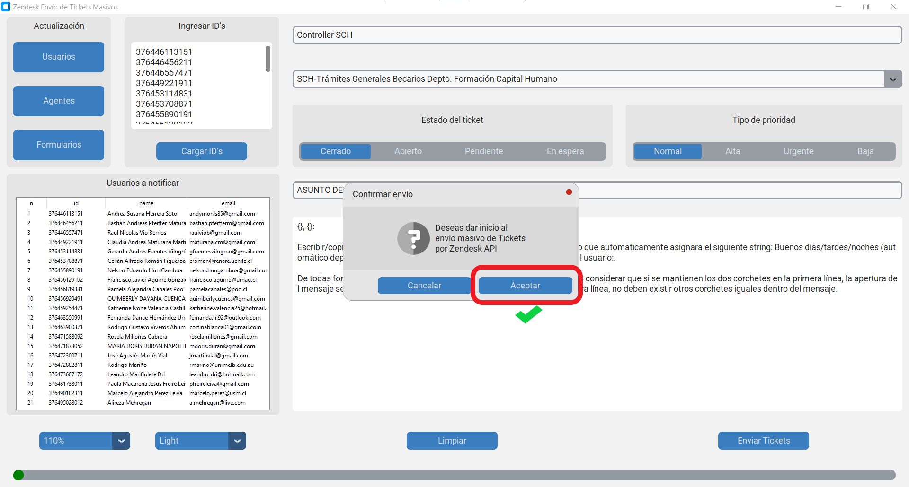

# AppZendesk


APP para envío masivo de tickets mediante conexión a la API de Zendesk.


## 0 - Instalar librerías del proyecto.

Luego de clonar el repo, instalar las librerias del proyecto ejecutando en la consola el archivo "requirements.txt".

```
pip install -r requirements.txt
```

Mediante pyinstaller, correr la siguiente linea:

```
pyinstaller --noconfirm --onefile --windowed --name "AppZendesk" --add-data "C:/Users/{RUTA AL PROYECTO}/AppZendesk/CTkMessagebox;CTkMessagebox/" --add-data "C:/Users/{RUTA AL PROYECTO}/AppZendesk/CTkScrollableDropdown;CTkScrollableDropdown/" --collect-all customtkinter -w "C:/Users/{RUTA AL PROYECTO}/AppZendesk/main.py"

```
<div align="center">
    
</div>


## 1 - Seleccionar ID's de usuarios a contactar

<div align="center">
    
</div>


## 2 - Copiar y pegar ID's

Se deben copiar (ctl + c) y pegar (ctl + v) todos los ID's dispuestos verticalmente (ver foto) o separados por una coma (,) o un espacio. Luego presionar el botón "Cargar ID's", para visualizar en la tabla id, nombre y correo de los usuarios a notificar. Mediante una advertencia se notificará la carga exitosa de los ID´s.

<div align="center">
    
</div>


## 3 - Seleccionar agente que notificará


Mediante la primera caja superior del costado derecho, es posible hacer doble click y desplazarse por la lista para seleccionar al Agente que emitirá la comunicación.

<div align="center">
    
</div>


## 4 - Seleccionar producto


Mediante la selección del producto se podrá activar el formulario que clasifica el tipo de comunicación dentro de la plataforma Zendesk.

<div align="center">
    
</div>


## 5 - Seleccionar estado y prioridad del ticket


Mediante los botones es posible seleccionar el estado y prioridad de los tickets a enviar.

<div align="center">
    
</div>


## 6 - Escribir asunto y mensaje


En cada caja es posible definir el asunto y el mensaje que se transmitirá a los usuarios.

<div align="center">
    
</div>


## 7 - Aceptar y enviar


Comenzará el proceso de notificación, para luego dejar en la carpeta un excel que tendrá el detalle de cada notificación realizada para efectos de seguimiento.

<div align="center">
    
</div>


## Anexo

La APP debe tener en la misma carpeta los archivos "usuarios_zendesk.json", "agentes_zendesk.json" y "formularios_zendesk.json". Estos archivos deben generarse de la siguiente forma, considerando como insumo el archvo "json_usuarios.json" descargado de la API:

```
from tqdm import tqdm
import pandas as pd

# Obtener la lista de usuarios
users = zenpy_client.users()

data = []
# Recorrer todos los usuarios con barra de progreso
with tqdm(total=len(users), desc="Procesando usuarios") as pbar:
    # Recorrer cada usuario
    for user in users:
        data.append(user.to_dict())  # Convertir el usuario a un diccionario y agregarlo a la lista

        # Actualizar la barra de progreso
        pbar.update(1)

# Guardar la lista de usuarios en el archivo JSON
with open("json_usuarios.json", "w") as file:
    json.dump(data, file, indent=2)

# Leer el archivo JSON como un DataFrame
df_users = pd.read_json("json_usuarios.json")

# Imprimir el DataFrame
print(df_users)

```

Luego leer el archivo mediante las siguientes lineas:

```
# Formularios
---

df_users = pd.read_json("json_usuarios.json")
df_users[["id","name","email"]].to_json("usuarios_zendesk.json")

# Agentes
---
df_users[df_users['role'] != 'end-user'][["id", "name", "email"]].to_json("agentes_zendesk.json", orient='records')

# Formularios
---
user = "XXXXX@XXX.cl"
token = "XXXXXXXXXXXXXXXXXXXXXXXXXXXXXXXXXXXXXX"
url_forms = "https://XXXXXXXXXXXX.zendesk.com/api/v2/ticket_forms.json"

data = {"ticket_forms": []}
max_retries1 = 3
retries1 = 0

while retries1 < max_retries1:
    try:
        response = requests.get(url_forms, auth=(user + "/token", token))
        if response.status_code == 200:
            ticket_forms = response.json()["ticket_forms"]
            for index, form in enumerate(tqdm(ticket_forms, desc="Procesando formularios", unit='form'),
                                         start=1):
                form_data = {
                    "form_id": form["id"],
                    "form_title": form["name"],
                    "form_fields": []
                }
                for field_id in form['ticket_field_ids']:
                    url = 'https://conicytoirs.zendesk.com/api/v2/ticket_fields/{}.json'
                    max_retries2 = 3
                    retries2 = 0

                    while retries2 < max_retries2:
                        try:
                            response_field = requests.get(url.format(field_id),
                                                          auth=(user + "/token", token))
                            response_field.raise_for_status()

                            if response_field.status_code == 200:
                                field_data = response_field.json()['ticket_field']
                                field_name = field_data['title']
                                form_data["form_fields"].append({
                                    "field_id": field_id,
                                    "field_title": field_name
                                })
                                break  # Salir del bucle while si la solicitud fue exitosa

                            elif response_field.status_code == 429:
                                seconds_to_wait = int(response.headers["Retry-After"])
                                print("Api transfer rate sobrepasada. Esperar:", seconds_to_wait,
                                      "segundos.")
                                time.sleep(seconds_to_wait)
                                retries1 += 1
                                if retries2 == max_retries2:
                                    field_data = response_field.json()['ticket_field']
                                    field_name = "field_data['title']"
                                    form_data["form_fields"].append({
                                        "field_id": "field_id",
                                        "field_title": "field_name"})
                            else:
                                print('Error al obtener el campo con ID {}: {}'.format(field_id,
                                                                                       response_field.status_code))
                                time.sleep(3)
                                retries2 += 1
                                if retries2 == max_retries2:
                                    field_data = response_field.json()['ticket_field']
                                    field_name = "field_data['title']"
                                    form_data["form_fields"].append({
                                        "field_id": "field_id",
                                        "field_title": "field_name"})

                        except requests.exceptions.SSLError:
                            print('Error SSL. Reintentando la solicitud...')
                            retries2 += 1
                            time.sleep(3)  # Esperar 3 segundos antes de reintentar

                data["ticket_forms"].append(form_data)
                self.progressbar.set(index / len(ticket_forms))
                self.update()

            break  # Salir del bucle while si la solicitud fue exitosa

        elif response.status_code == 429:
            seconds_to_wait = int(response.headers["Retry-After"])
            print("Api transfer rate sobrepasada. Esperar:", seconds_to_wait, "segundos.")
            time.sleep(seconds_to_wait)
            retries1 += 1

        else:
            print("Error al obtener los formularios. Código de estado:", response.status_code)
            time.sleep(3)
            retries1 += 1

    except requests.exceptions.SSLError:
        print('Error SSL. Reintentando la solicitud...')
        retries1 += 1
        time.sleep(3)  # Esperar 3 segundos antes de reintentar

# Guardar los datos en un archivo JSON
with open("formularios_zendesk.json", "w") as file:
    json.dump(data, file)

# Leer el archivo JSON
with open('formularios_zendesk.json', 'r') as file:
    data = json.load(file)

# Aplanar los diccionarios en columnas del DataFrame
df = pd.json_normalize(data, 'ticket_forms', errors='ignore')
df = df.explode('form_fields')
df = pd.concat([df.drop(['form_fields'], axis=1), df['form_fields'].apply(pd.Series)], axis=1)

# Obtener la fecha y hora actual
fecha_actual = datetime.datetime.now().strftime("%d-%m-%Y")
hora_actual = datetime.datetime.now().strftime("%H.%M")
# Obtener la cantidad de registros en el DataFrame
total_rows = len(df)
# Generar el nombre del archivo de Excel
nombre_archivo = f"Formularios [{fecha_actual} (d-m-y)] [{hora_actual} (h.m)] [{total_rows} registros].xlsx"

df.to_excel(nombre_archivo, index=False)

```
