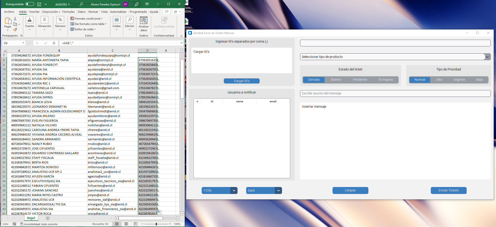
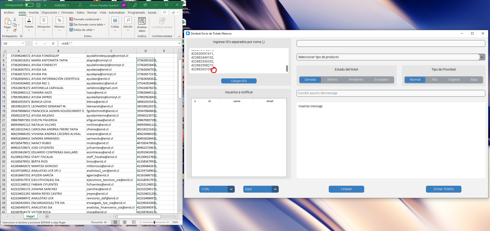
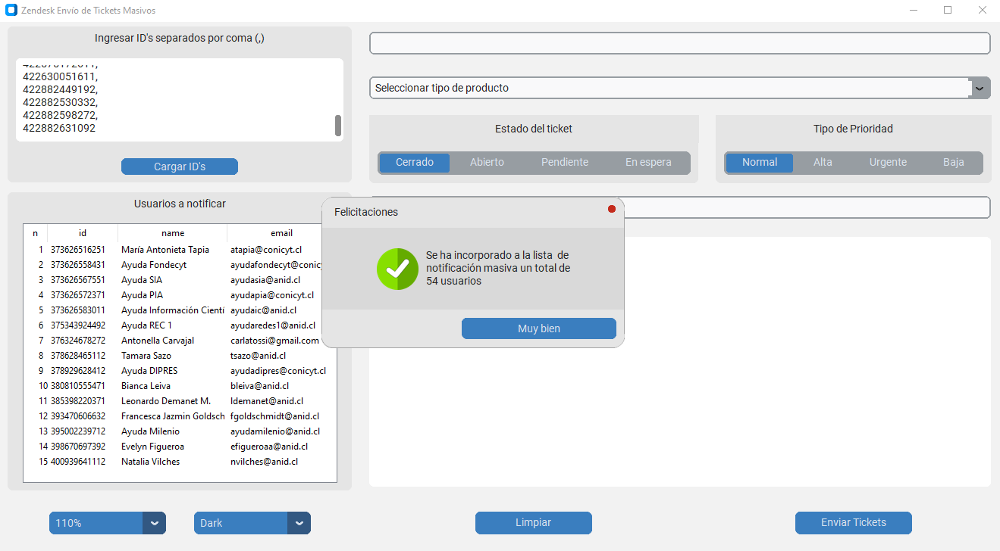
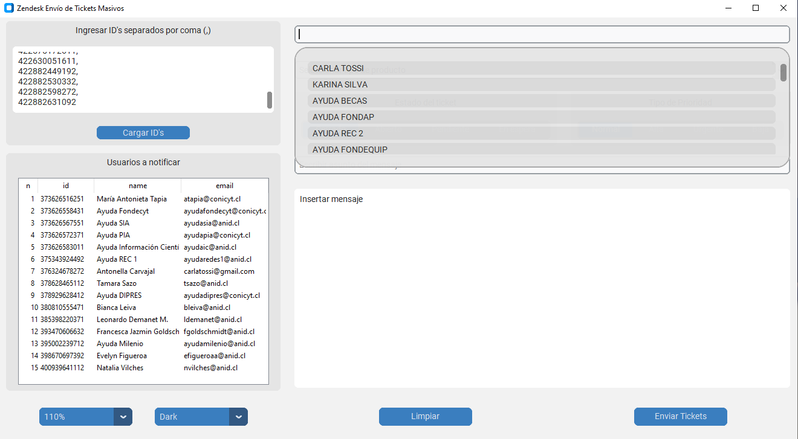
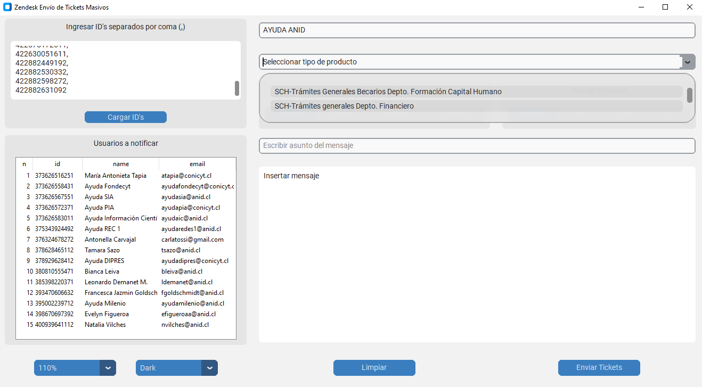
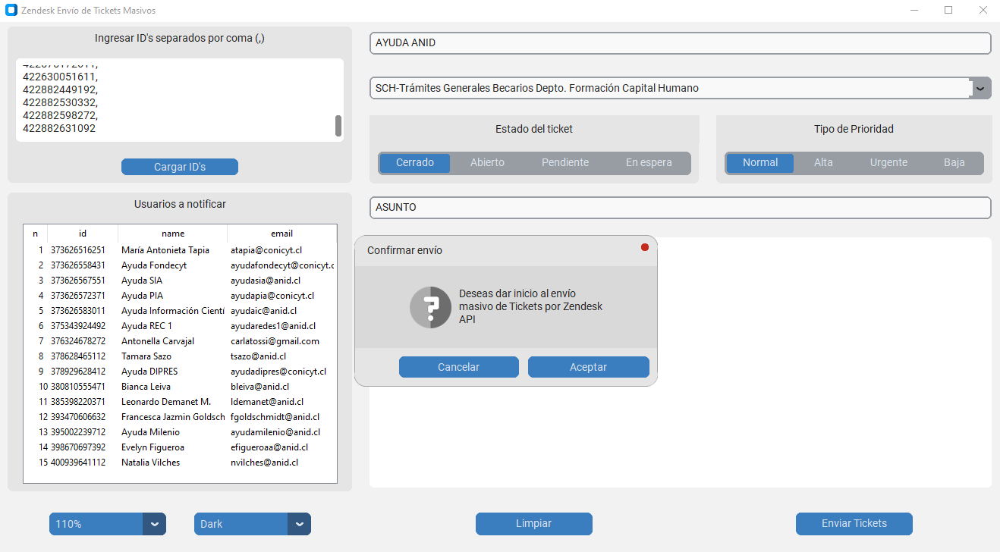

# AppZendesk

APP para envío masivo de tickets mediante conexión a la API de Zendesk.

## 1 - Seleccionar ID's de usuarios a contactar
---

    

## 2 - Copiar y pegar ID's
---

Se deben copiar y pegar todos los ID's separados por una coma (,). Notar que el último registro no debe tener una coma, pues la aplicación no permitirá realizar la carga si no es este el caso. 

    

## 3 - Presionar el botón "Cargar ID's"
---

Luego de cumplir el paso anterior, es necesario presionar el botón para cargar los usuarios. Mediante una advertencia se notificará la carga exitosa de los ID´s.

    

## 4 - Seleccionar Agente que Notificará
---

Mediante la primera caja superior del costado derecho, es posible hacer dobleclick y desplazarse por la lista para seleccionar al Agente que emitirá la comunicación.

    

## 5 - Seleccionar Producto
---

Mediante la selección del producto se podrá activar el formulario que clasifica el tipo de comunicación dentro de la plataforma Zendesk.

    

## 6 - Escribir asunto y mensaje
---

En cada caja es posible definir el asunto y el mensaje que se transmitirá a los usuarios.

    

## 7 - Aceptar y enviar
---

Comenzará el proceso de notificación, para luego dejar en la carpeta un excel que tendrá el detalle de cada notificación realizada para efectos de seguimiento.

    

